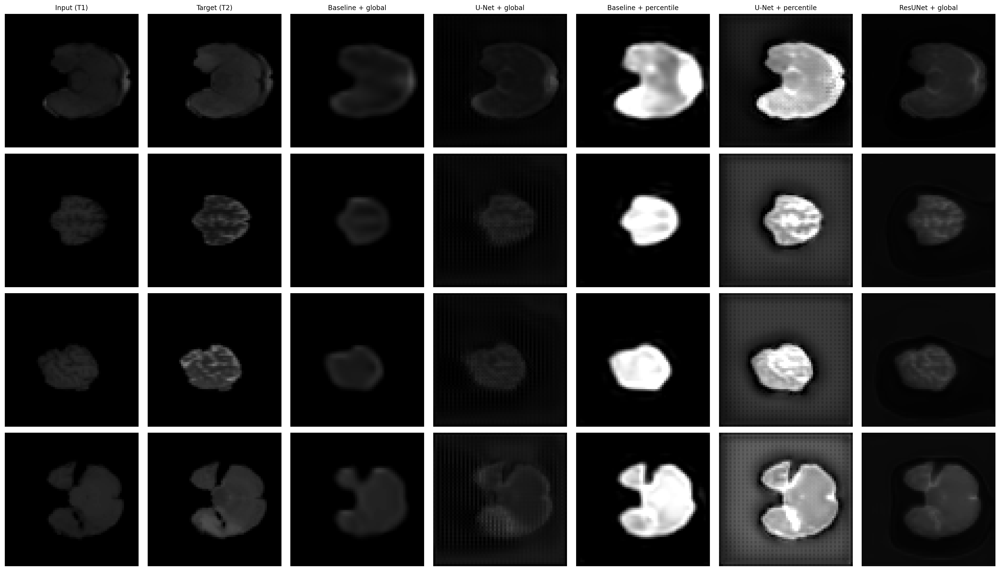
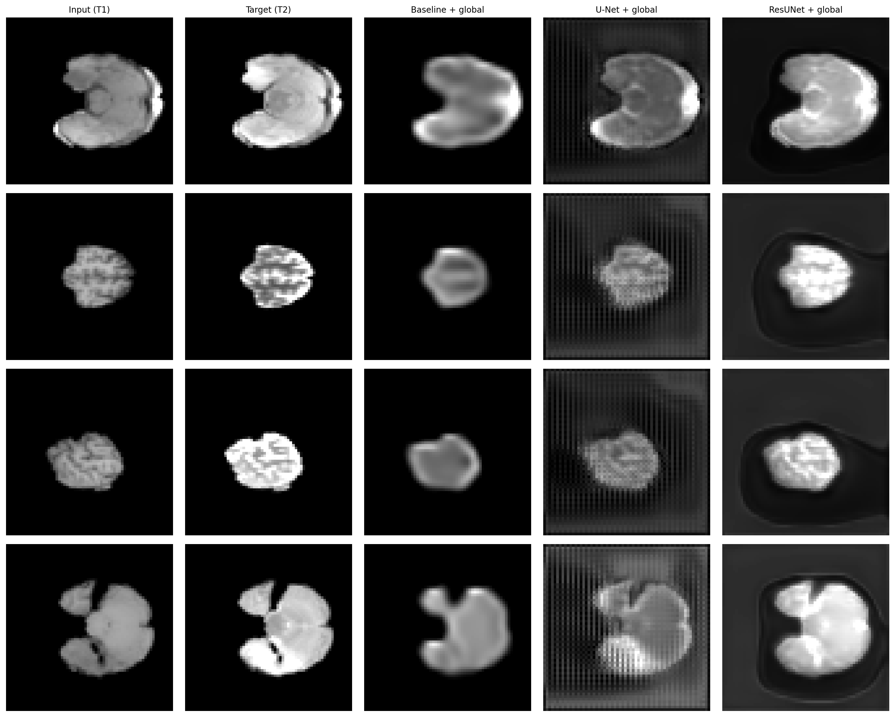
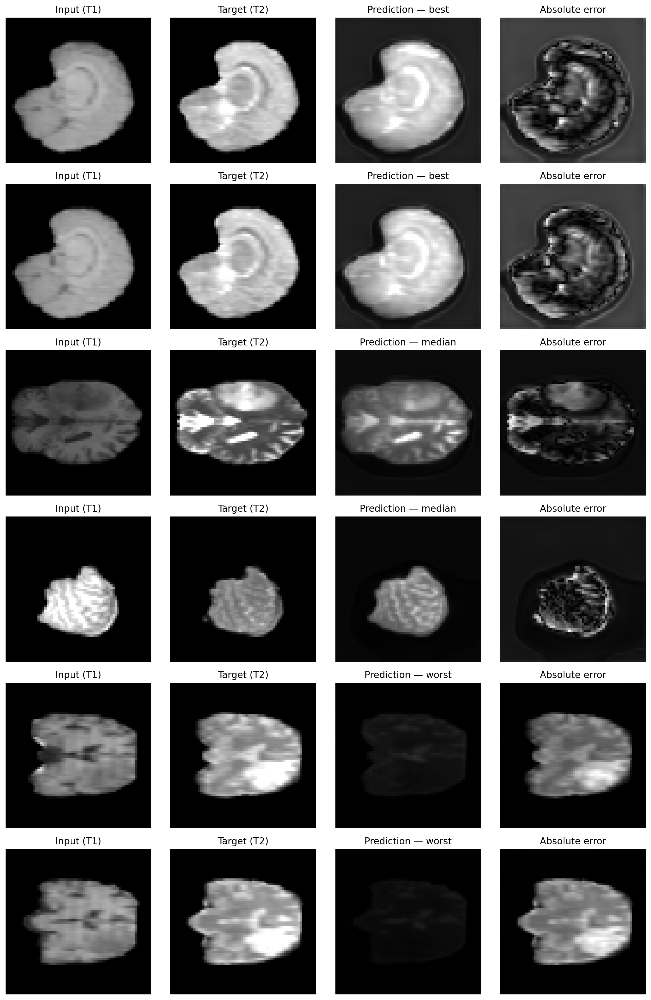

# MRI Modality Translation with PyTorch

A clean, reproducible PyTorch refactor of an Imperial College MSc medical imaging project for **paired T1→T2 brain MRI slice translation**.

The task is to use a **single T1-weighted MRI slice** to predict the corresponding **T2-weighted MRI slice**. The original project began as a notebook-based coursework implementation. This repository preserves that core experiment honestly, then restructures it into a modular research codebase with:

- reusable PyTorch code under `src/`
- scripted dataset preparation and local caching
- deterministic patient-level train / validation / test splits
- config-driven train and evaluation workflows
- saved checkpoints, metrics, and qualitative artifacts
- a cleaner experimental narrative around preprocessing and model design choices

The final repository keeps the scope deliberately tight. It is a reproducible image-to-image translation project, not a clinical system and not a production medical AI deployment.

---

## Overview

This repository started as a single notebook that mixed together:

- exploratory data analysis
- preprocessing and normalization
- dataset loading
- model definition
- training loops
- evaluation
- qualitative plotting

The refactor separates those concerns into a proper Python package so the project is easier to:

- inspect
- rerun
- compare
- test
- extend
- present as a clean applied ML / research engineering project

The repository now supports:

- local dataset caching from Hugging Face
- deterministic patient-grouped split generation
- multiple config-driven experiments
- evaluation on a held-out test split
- saved qualitative prediction panels
- a small but meaningful normalization ablation
- a final improved model selected from observed failure modes rather than architectural novelty

---

## Problem formulation

This is a **paired 2D medical image translation** problem.

- **Input:** one T1-weighted MRI slice
- **Target:** the corresponding T2-weighted MRI slice
- **Image size:** 64 × 64
- **Channels:** single-channel grayscale
- **Views present:** axial, sagittal, coronal
- **Learning setup:** supervised image-to-image regression

The source dataset is the Hugging Face dataset:

- `dpelacani/mri-t1-t2-2D-sliced-64`

The original source dataset provides predefined train and validation splits. In this repository, those source splits are merged locally and then re-split into a deterministic **patient-level train / validation / test split**. That produces a more defensible evaluation setup and reduces leakage between highly related slices from the same patient.

---

## Why this repository exists

The original notebook was sufficient for coursework submission, but it was not an ideal final project artifact. The notebook mixed exploratory work and reusable training logic in one place, and it made it difficult to:

- preserve exact experiment settings
- rerun training cleanly
- compare model variants
- separate data preparation from training
- save reusable outputs for later analysis

This repository fixes that by moving the core logic into `src/`, keeping notebooks focused on analysis rather than training, and making the workflow reproducible from configuration files.

---

## Dataset structure and modelling implications

This dataset is already heavily preprocessed before it reaches the repository:

- 2D slices rather than full 3D volumes
- fixed spatial resolution of 64 × 64
- paired T1 / T2 slices
- view metadata
- patient identifiers

That structure matters for model selection.

This project deliberately starts with simple and interpretable supervised baselines before moving to a stronger final model. It does **not** jump straight to GANs, diffusion models, or large transformer-style image translation approaches. Given:

- relatively small 64 × 64 paired slices
- a supervised paired setup
- the need for a strong but honest baseline
- the desire to keep the repo understandable and reproducible

it was more appropriate to compare:

1. a simple encoder-decoder baseline
2. a standard U-Net baseline
3. a final improved ResUNet chosen after observing the U-Net’s artifact behaviour

In other words, this repository prioritises **clear experimental reasoning and data-efficient inductive bias** over architectural novelty for its own sake.

---

## Data preparation and split generation

This repository separates **data preparation** from **training and evaluation**.

The data preparation step does four things:

1. downloads or reuses the Hugging Face dataset locally
2. saves a local copy under `data/raw/`
3. merges the source train and validation splits
4. creates a deterministic patient-grouped train / validation / test split manifest under `data/splits/`

This means model training does not depend on repeated online dataset downloads and does not create a new random split every run.

### Why patient-level splitting matters

Slices from the same patient are strongly related. A slice-level random split would make the task easier in a way that overstates generalization. This repository therefore uses a **grouped patient split** so the held-out evaluation is more realistic.

### Split summary

| Split | Samples | Patients | Axial | Coronal | Sagittal |
|---|---:|---:|---:|---:|---:|
| train | 108,360 | 258 | 25,800 | 41,280 | 41,280 |
| val | 22,680 | 55 | 5,400 | 8,640 | 8,640 |
| test | 24,570 | 56 | 5,850 | 9,360 | 9,360 |

A saved version of this table is also available at `reports/tables/split_summary.md`.

---

## Normalization choice

The source intensities are skewed and contain large low-intensity background regions. That made normalization an important design decision.

Two normalization strategies were tested:

1. **global min-max**
2. **percentile min-max**

The normalization ablation was useful, but the conclusion was clear: **global min-max performed better overall on the held-out test split**.

Percentile min-max produced some visually appealing outputs in isolated cases, but it was substantially worse and less stable overall. It is therefore retained in the repository as a **useful failed ablation**, not as the final preprocessing choice.

---

## Model progression and design choices

### 1. Simple encoder-decoder baseline

The first model is a small encoder-decoder used as a low-capacity baseline.

Why include it:
- it is easy to optimise
- it establishes a simple reference point
- it helps distinguish “stable but blurry” behaviour from genuinely stronger translation models

Observed behaviour:
- stable training
- comparatively clean backgrounds
- overly smooth and blurry reconstructions

### 2. U-Net baseline

The second model is a standard U-Net with skip connections.

Why include it:
- skip connections are a natural next step for paired image translation
- it preserves more spatial detail than the simple encoder-decoder
- it is a strong baseline for low-resolution supervised translation

Observed behaviour:
- better structural detail than the encoder-decoder
- stronger performance on MSE / RMSE
- visible background artifacts and low-information-region texture issues

### 3. Final model: ResUNet

The final model is `resunet_global_minmax`.

This is not just a copy of the U-Net with residual blocks. It was chosen specifically to address the artifact patterns observed in the standard U-Net.

The final ResUNet uses:

- **residual encoder / decoder blocks**
- **bilinear upsampling + convolution**
  - instead of transpose convolutions
- **InstanceNorm2d**
  - instead of BatchNorm2d
- **sigmoid output head**
  - to keep predictions in `[0, 1]`

Why these changes were made:
- residual blocks improve feature flow and optimisation
- bilinear upsampling reduces checkerboard / fractal-style decoder artifacts
- InstanceNorm is often a better fit than BatchNorm for this kind of medical image translation setting
- a sigmoid output keeps predictions consistent with the normalized target range

The ResUNet was selected as the final model because it gave the strongest overall balance between:
- quantitative performance
- structural fidelity
- reduced artifact severity

---

## Repository layout

```text
mri-modality-translation/
├─ configs/
├─ data/
│  ├─ cache/
│  ├─ raw/
│  └─ splits/
├─ notebooks/
├─ outputs/
├─ reports/
├─ scripts/
├─ src/mri_translation/
└─ tests/
```

### Main package structure

```text
src/mri_translation/
├─ data/
│  ├─ datasets.py
│  ├─ download.py
│  ├─ normalization.py
│  ├─ splits.py
│  ├─ stats.py
│  └─ transforms.py
├─ engine/
│  ├─ evaluate.py
│  └─ train.py
├─ models/
│  ├─ baseline.py
│  ├─ factory.py
│  ├─ resunet.py
│  └─ unet.py
├─ utils/
│  ├─ io.py
│  └─ seed.py
├─ viz/
│  └─ plots.py
├─ config.py
└─ metrics.py
```

---

## What is implemented

- local dataset download and caching from Hugging Face
- deterministic patient-level split generation
- configurable global min-max and percentile min-max normalization
- PyTorch dataset and dataloader abstractions
- simple encoder-decoder baseline
- U-Net baseline
- ResUNet final model
- train loop with:
  - AMP support
  - learning-rate reduction on plateau
  - early stopping
  - checkpoint saving
- evaluation on validation or test split
- saved JSON metrics and qualitative prediction grids
- analysis notebooks driven from saved outputs rather than notebook-only training logic

---

## Installation

Create and activate a virtual environment:

```bash
python -m venv .venv
source .venv/bin/activate
pip install -e ".[dev]"
pre-commit install
```

This installs runtime and development dependencies, including:

- PyTorch
- NumPy / pandas / matplotlib
- Hugging Face `datasets`
- PyYAML
- pytest
- ruff
- pre-commit

Notebook table export via `pandas.to_markdown()` requires the `tabulate` package, which is included in the development dependencies.

---

## Hugging Face setup and data preparation

The source dataset is hosted on Hugging Face.

Unauthenticated access may still work, but a Hugging Face token gives more reliable access and avoids rate limits.

### Option 1: environment variable

```bash
export HF_TOKEN="your_token_here"
```

### Option 2: Hugging Face CLI login

```bash
huggingface-cli login
```

### Prepare the local dataset and split manifest

```bash
python scripts/prepare_data.py --config configs/resunet_global_minmax.yaml
```

This will:

- download or reuse the Hugging Face dataset
- save a local dataset under `data/raw/`
- reuse or regenerate the split manifest under `data/splits/`

The split manifest can be regenerated with:

```bash
python scripts/prepare_data.py \
  --config configs/resunet_global_minmax.yaml \
  --regenerate-splits
```

The raw cached data is not intended to be committed to Git.

---

## Core commands

### Prepare the dataset and patient-level split

```bash
python scripts/prepare_data.py --config configs/resunet_global_minmax.yaml
```

### Train the final model

```bash
python scripts/train.py --config configs/resunet_global_minmax.yaml
```

### Evaluate the final model on the held-out test split

```bash
python scripts/evaluate.py \
  --config configs/eval.yaml \
  --checkpoint outputs/runs/resunet_global_minmax/best.pt \
  --model-name resunet \
  --split test
```

### Train the baseline encoder-decoder

```bash
python scripts/train.py --config configs/baseline_encoder_decoder_global_minmax.yaml
```

### Train the U-Net baseline

```bash
python scripts/train.py --config configs/unet_global_minmax.yaml
```

### Train the percentile-minmax ablation runs

```bash
python scripts/train.py --config configs/baseline_encoder_decoder_percentile_minmax.yaml
python scripts/train.py --config configs/unet_percentile_minmax.yaml
```

---

## Useful CLI arguments

### `scripts/prepare_data.py`

- `--config` — path to YAML config
- `--force-download` — rebuild the local dataset even if it already exists
- `--regenerate-splits` — recreate the split manifest even if one already exists

### `scripts/train.py`

- `--config` — path to experiment config

### `scripts/evaluate.py`

- `--config` — path to evaluation config
- `--checkpoint` — checkpoint to load
- `--model-name` — override the model to evaluate
- `--split` — choose `train`, `val`, or `test`

---

## Outputs and reproducibility

Training and evaluation save artifacts under `outputs/runs/<experiment_name>/`.

Typical saved artifacts include:

- copied `config.yaml`
- `best.pt`
- `last.pt`
- `history.json`
- `metrics.json`
- `metrics_test.json`
- `data_info.json`
- `training_history.png`
- `prediction_grid.png`
- `prediction_grid_test.png`

This makes experiments inspectable without depending on notebook state.

---

## Results

The final experiment set in this repository is:

1. `baseline_encoder_decoder_global_minmax`
2. `unet_global_minmax`
3. `baseline_encoder_decoder_percentile_minmax`
4. `unet_percentile_minmax`
5. `resunet_global_minmax`

### Held-out test results

| Run | Normalization | MSE | MAE | RMSE | PSNR | SSIM |
|---|---|---:|---:|---:|---:|---:|
| `baseline_encoder_decoder_global_minmax` | global min-max | 0.000667 | 0.005515 | 0.025826 | 45.40 | 0.9283 |
| `unet_global_minmax` | global min-max | 0.000372 | 0.007243 | 0.019291 | 43.16 | 0.8559 |
| `baseline_encoder_decoder_percentile_minmax` | percentile min-max | 0.001744 | 0.012532 | 0.041756 | 35.74 | 0.8011 |
| `unet_percentile_minmax` | percentile min-max | 0.001580 | 0.025495 | 0.039747 | 31.79 | 0.3632 |
| `resunet_global_minmax` | global min-max | 0.000580 | 0.006481 | 0.024082 | 43.97 | 0.9029 |

A saved version of the held-out test results table is also available at `reports/tables/test_results_table.md`.







### Interpretation

The normalization ablation was useful but decisive: **global min-max was the stronger preprocessing choice** in this setup.

The baseline encoder-decoder was stable and comparatively clean, but too blurry to serve as the final model.

The standard U-Net improved structural detail and achieved the strongest MSE / RMSE values, but it also showed visible background artifacts in low-information regions.

Although `unet_global_minmax` achieved the strongest MSE / RMSE values among the pre-ResUNet models, the final model selection is `resunet_global_minmax` because it provides a better overall balance between quantitative performance, structural fidelity, and reduced background artifact severity.

The final ResUNet gave the strongest overall balance:
- substantially cleaner qualitative behaviour than the U-Net
- much stronger structure than the simple encoder-decoder
- competitive held-out metrics
- reduced artifact severity through:
  - residual blocks
  - bilinear upsampling
  - InstanceNorm
  - sigmoid output

An important outcome of this project is that **quantitative and qualitative rankings did not align perfectly**. That is exactly why the repository keeps both metric tables and qualitative panels rather than relying on one view alone.

The normalization ablation is also summarized visually in `reports/figures/normalization_ablation_deltas.png` and numerically in `reports/tables/normalization_ablation_deltas.md`.

### Saved report artifacts

Additional saved tables and figures are available under:

- `reports/tables/test_results_table.md`
- `reports/tables/normalization_ablation_deltas.md`
- `reports/tables/resunet_per_view_metrics.md`
- `reports/tables/qualitative_summary_table.md`
- `reports/tables/qualitative_selected_samples.md`
- `reports/figures/qualitative_ablation_panel.png`
- `reports/figures/qualitative_final_model_panel.png`
- `reports/figures/resunet_best_median_worst_panel.png`
- `reports/figures/normalization_ablation_deltas.png`
- `reports/figures/resunet_error_distributions.png`
- `reports/figures/resunet_per_view_metrics.png`

---

## Notebooks

The notebooks are deliberately thin and analysis-focused. They read from saved dataset artifacts, split manifests, checkpoints, and metrics rather than re-implementing training logic inside notebook cells.

- `01_dataset_eda.ipynb`
  - dataset overview
  - split summary
  - sample pairs
  - raw intensity histograms
  - normalization context

- `02_qualitative_results.ipynb`
  - side-by-side qualitative comparison across runs
  - focused comparison of final global-minmax models
  - commentary on blur, structure, and background behaviour

- `03_error_analysis.ipynb`
  - consolidated results table
  - normalization ablation summary
  - per-view comparison
  - best / median / worst examples for the final model

Core training and evaluation logic lives in `src/`, not in notebook cells.

---

## What this project does **not** claim

This repository should not be framed as:

- a clinical diagnostic system
- a validated radiology workflow
- a deployment-ready medical imaging product
- state-of-the-art MRI synthesis
- a full hospital-grade MLOps pipeline

It is a clean, reproducible PyTorch refactor of an MSc medical image translation project with a small but meaningful experimental progression.

---

## Limitations

- the task is performed on **2D slices**, not full 3D volumes
- the dataset is already highly preprocessed before entering this repository
- evaluation is limited to this dataset and split strategy
- pixel-wise metrics do not fully capture perceptual or structural fidelity
- the remaining low-intensity background bias around the brain is reduced in the final model but not completely removed
- no clinical utility claims are made

---

## Future work

- test whether a mild foreground-aware loss improves background suppression without distorting anatomy
- investigate 3D context or small multi-slice context windows
- add a more careful per-view / per-patient error analysis
- compare against alternative normalization or intensity standardization methods only if they can be justified by the held-out results
- keep the repo focused on reproducible model comparisons rather than turning it into a generic medical imaging framework

---

## Quickstart

```bash
python -m venv .venv
source .venv/bin/activate
pip install -e ".[dev]"
pre-commit install
export HF_TOKEN="your_token_here"

python scripts/prepare_data.py --config configs/resunet_global_minmax.yaml
pytest -q

python scripts/train.py --config configs/resunet_global_minmax.yaml

python scripts/evaluate.py \
  --config configs/eval.yaml \
  --checkpoint outputs/runs/resunet_global_minmax/best.pt \
  --model-name resunet \
  --split test
```

---

## Acknowledgements

This repository is based on an Imperial College MSc medical imaging project and was later refactored into a cleaner and more reproducible research codebase.
